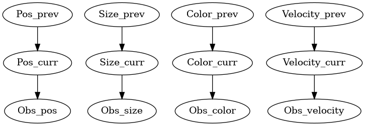

# Probabilistyczne Śledzenie Wielu Obiektów z Sieciami Bayesowskimi

Projekt implementuje probabilistyczny system śledzenia obiektów wykorzystujący Sieci Bayesowskie (Probabilistyczne Modele Grafowe) w sekwencjach klatek wideo.

## Przegląd

System śledzenia wykorzystuje Sieć Bayesowską, która poniższe cechy dla solidnego kojarzenia obiektów:
- **Pozycja**: Różnica pozycji (wartości x, y) między detekcjami
- **Rozmiar**: Różnica wielkości Bounding Boxa
- **Kolor**: Porównanie kolorów oparte na histogramach z użyciem OpenCV
- **Prędkość**: Różnice w prędkości i kierunku ruchu

## Struktura Sieci Bayesowskiej

System opiera się na informacji z poprzedniej klatki do przewidywania stanu bieżącej klatki. Struktura sieci jest następująca. Niestety nie połączono ze sobą drzew, końcowa wartość jest na podstawie mnożeń skłądowych wartości prawdopodobieństw.

```
Stany Poprzedniej Klatki -> Stany Bieżącej Klatki -> Obserwacje
```




### Zmienne Sieci:
- `Pos_prev/Pos_curr`: Stany pozycji (taka sama, bliska, daleka)
- `Size_prev/Size_curr`: Stany rozmiaru (taki sam, podobny, różny)  
- `Color_prev/Color_curr`: Stany koloru (taki sam, podobny, różny)
- `Velocity_prev/Velocity_curr`: Stany prędkości (taka sama, podobna, różna)

Wartości te przekazywane są jako obserwacje:
- `Obs_*`: Zmienne obserwacji dla każdej cechy

## Użycie

### Podstawowe Użycie
```bash
python main.py <folder_danych>
```

### Tryb Debugowania
Do wyświetlania większej liczby informacji o wykryciach i trackingu oraz wizualizacji klatek, zmodyfikuj ostatnią linię w `main.py`:
```python
main(debug=True)  # Pokazuje obrazy klatek i szczegółowe informacje o śledzeniu
```

## Format Wejściowy

System oczekuje:
- folderu danych o poniższej strukturze, np. komenda `python main.py data` obsłuży poniższą strukturę plików: 
  ```
  data
  ├── frames
    ├── c6s1_000451.jpg
    ├── c6s1_000476.jpg
    ...
  └── bboxes.txt
  main.py
  ```

## Szczegóły Implementacji

### Tracking ID
- Wewnętrzne śledzenie używa unikalnych przyrastających ID
- ID wyświetlania pokazują indeks tablicy detekcji dla kontynuowanych śladów
- Nowe detekcje wyświetlają się jako `-1`

### Analiza Kolorów
- Konwertuje obrazy do przestrzeni kolorów HSV
- Oblicza histogramy 3D (Odcień, Nasycenie, Wartość)
- Używa porównania opartego na korelacji dla podobieństwa

### Obliczanie Prędkości
- Śledzi przemieszczenie między kolejnymi klatkami
- Uwzględnia zmiany zarówno wielkości jak i kierunku
- Normalizuje przez różnice klatek dla spójności czasowej